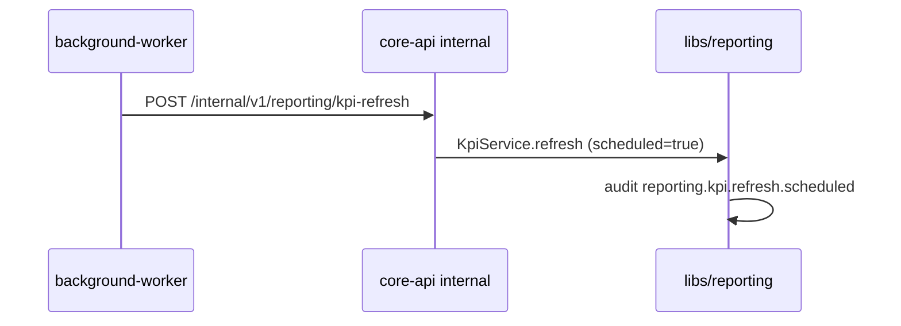
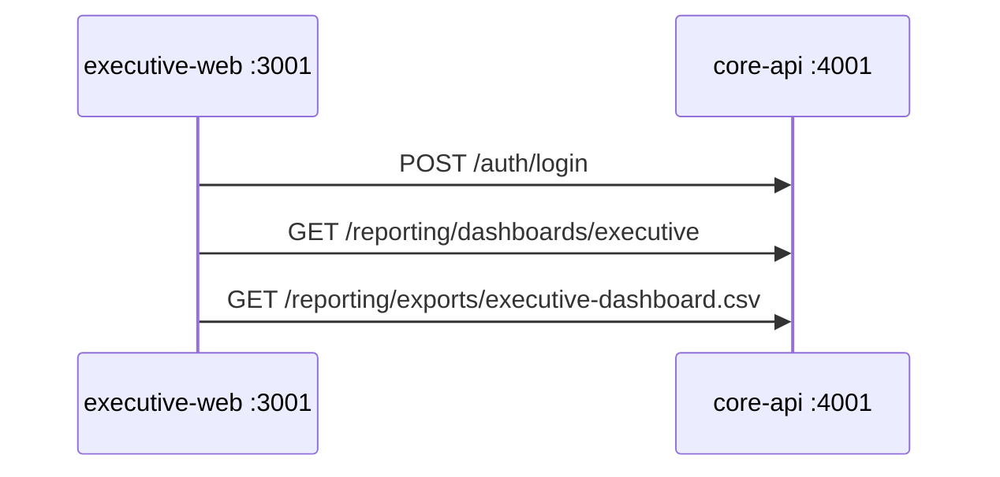

# Phase 7b — Executive Analytics Polish

> Sprint scope: scheduled KPI refresh, CSV export, minimal `executive-web` (3001).  
> Defer: `reporting-service` (4005), RLS, PDF/Excel, real ML, Dockerized frontend.

## Goals

1. **Automate KPI snapshots** — `background-worker` calls internal refresh daily (no duplicate logic in worker).
2. **CSV export** — executives download dashboard data for Excel/Sheets.
3. **First executive UI** — login + KPI grid grouped by category.

## Architecture





## Backend

| Component | Change |
|---|---|
| `KpiRefreshJob` | Daily cron via `setInterval` + UTC window env |
| `InternalController` | `POST reporting/kpi-refresh` (ServiceTokenGuard) |
| `ExportService` | CSV builder + `reporting.export.csv` audit |
| `KpiService.refresh` | `scheduled` flag → distinct audit action |

### Env

```bash
KPI_REFRESH_ENABLED=true
KPI_REFRESH_UTC_HOUR=21      # 00:00 EAT
KPI_REFRESH_UTC_MINUTE=5
KPI_REFRESH_INTERVAL_MS=0    # >0 overrides daily window (dev)
```

## Frontend

- Turborepo root under `frontend/`
- `apps/executive-web` on port **3001**
- Shared: `packages/api-client`, `packages/ui`
- Pages: `/login`, `/dashboard`

## Still deferred (Phase 7c+)

- `apps/reporting-service` (4005)
- PostgreSQL RLS on `reporting.*`
- PDF/Excel via `libs/documents`
- Charts, insights panel polish
- Playwright E2E

## E2E

`scripts/phase7b-e2e.sh` — internal refresh, CSV export, audit, worker health.
