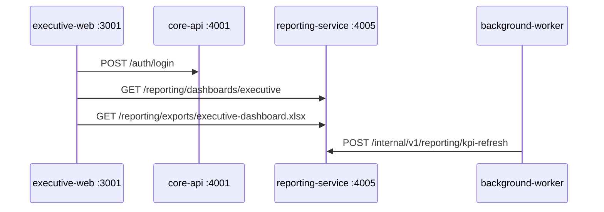

# Phase 7c — Reporting Extraction & Exports

> Sprint: extract `reporting-service` (4005), PDF/Excel exports, RLS on `reporting.*`.  
> Defer: real ML models, scheduled email reports, MinIO async exports.

## Goals

1. **Isolate read-heavy reporting** from `core-api` write path
2. **Board pack exports** — CSV (exists) + XLSX + PDF
3. **Defense-in-depth RLS** on `reporting.*` tables

## Architecture

## Route ownership

| Route | Service |
|---|---|
| `/auth/*` | core-api :4001 |
| `/reporting/*` | reporting-service :4005 |
| `/internal/v1/reporting/kpi-refresh` | reporting-service :4005 |
| `/audit/logs` | core-api :4001 |

## Exports

| Format | Library | Audit action |
|---|---|---|
| CSV | string builder | `reporting.export.csv` |
| XLSX | exceljs | `reporting.export.xlsx` |
| PDF | pdfkit | `reporting.export.pdf` |

All formats call `KpiService.computeAll()` — payroll from `PayslipSnapshot` only.

## RLS

- Migration: `prisma/migrations/0001_reporting_rls/migration.sql`
- Helper: `PrismaService.withOrgContext(organizationId, fn)`
- Used for reads/writes on `reporting.*` only

## Deferred (Phase 8+)

- Real ML in analytics-ai-service
- `libs/documents` + MinIO async exports
- Platform-wide RLS on other schemas
- api-gateway BFF (4000)

## E2E

`scripts/phase7c-e2e.sh` — auth on 4001, reporting on 4005, xlsx/pdf magic bytes, RLS smoke.
