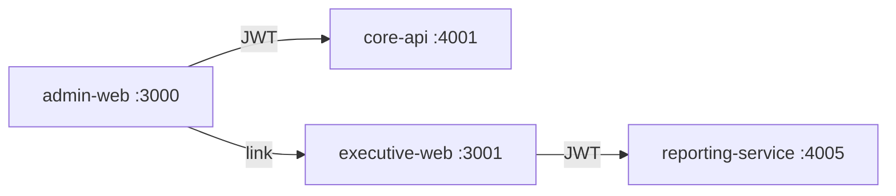

# Phase 8 — Internal Admin Portal (`admin-web` :3000)

## Goals

1. **One internal shell** — role-filtered navigation across 12 portals
2. **Wire core domains** to `core-api` :4001 (portal ≠ service)
3. **Scaffold** remaining portals for Phase 8b

## Architecture



## Packages

| Package | Role |
|---|---|
| `@pssms/auth` | Cookie session, auth headers |
| `@pssms/permissions` | Nav filter, route permission map |
| `@pssms/api-client` | `admin.ts` — customers, contracts, guards, finance, HR |
| `@pssms/ui` | `AdminShell`, `DataTable`, `StatusBadge` |

## Wired portals (Phase 8a)

- `/superadmin` — dashboard counts
- `/superadmin/customers` — list + create
- `/superadmin/contracts` — list + activate
- `/operations` — guards + status toggle
- `/finance` — invoices send/pay
- `/hr` — employees + leave queue
- `/compliance` — audit log viewer
- `/branch` — branches list
- `/developer` — service health
- `/marketing` — customer count

## Scaffold (Phase 8b)

`/payroll`, `/procurement`, `/cctv`, `/callcentre`

## Deferred

- Keycloak SSO, api-gateway BFF
- Full CRUD forms, approvals UI
- Playwright, i18n
- External portals (customer-web, etc.)

## Dev

```bash
cd frontend
npm install
cp apps/admin-web/.env.local.example apps/admin-web/.env.local
npm run dev --workspace=admin-web
```

Login: `admin@highlink.co.tz` / `ChangeMe123!`
